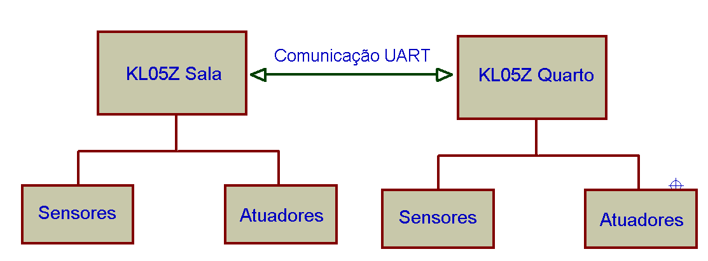
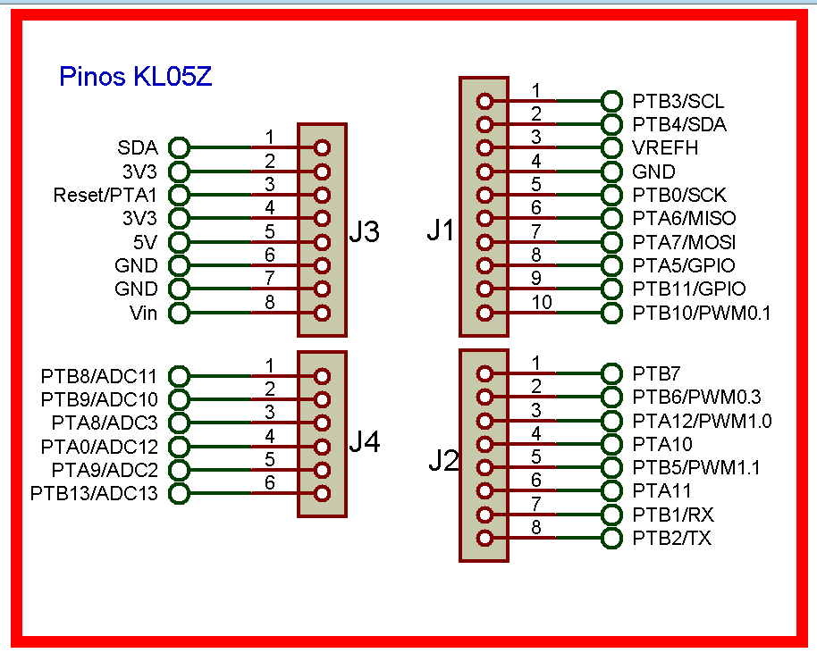
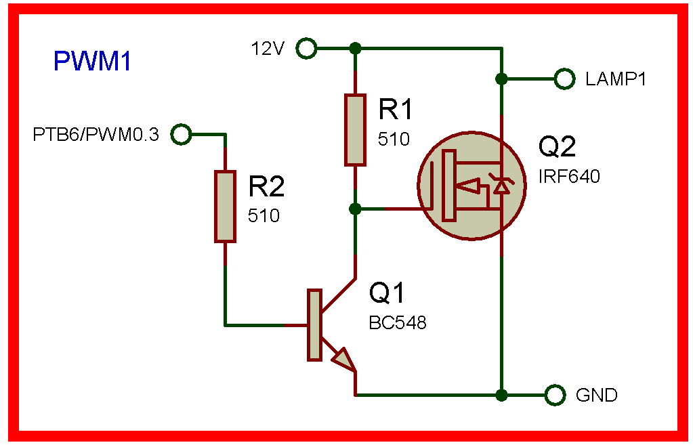
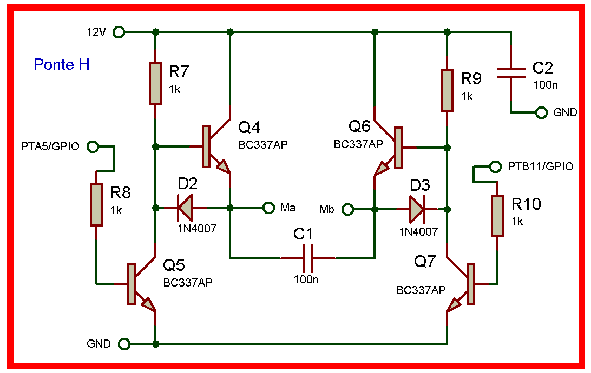
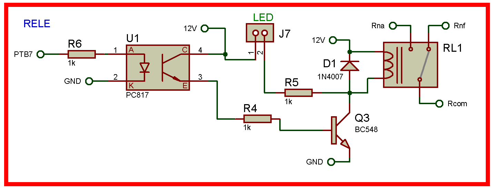
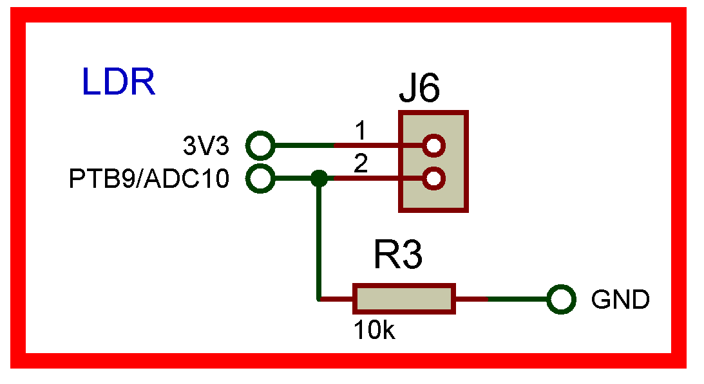
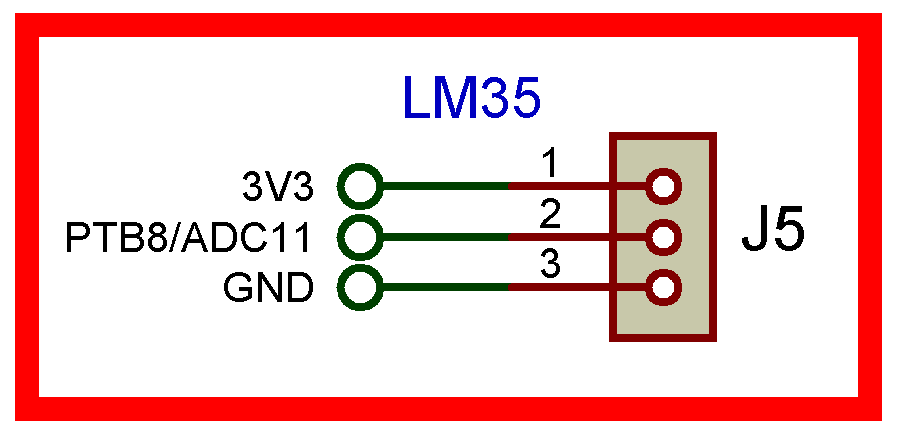

#Estrutura de Funcionamento 

Conforme já explicado serão implementados dois módulos de controle, um para a sala e outro para o quarto, sendo que a comunicação entre eles será via UART. 

**Módulos por cômodo** 

Quarto:
1 lâmpada → PWM controle da luminosidade via tela → Driver com transistores
1 cortina → GPIO controle do sentido de rotação → Ponte H
1 ventilador → GPIO controle liga e desliga → Modulo rele 
1 sensor de luz → ADC controle abre e fecha cortina → Driver com LDR
1 sensor de temperatura → ADC controle liga e desliga ventilador → Driver com LM35
1 tela ao toque → SPI controla todos os comandos e modos de operação 

Sala: 
3 lâmpadas → PWM controle da luminosidade via tela → Driver com transistores
1 cortina → GPIO controle do sentido de rotação → Ponte H
1 tomada → GPIO controle liga e desliga → Modulo rele 
1 sensor de luz → ADC controle abre e fecha cortina → Driver com LDR
1 tela ao toque → SPI controla todos os comandos e modos de operação 

**Interface de Controle**

Menu de controle na tela:
Iluminação sala
Cenário 1 
Cenário 2
Cenário 3 

Iluminação quarto
Controle de intensidade

Cortina sala
Controle via porcentagem de abertura

Cortina quarto
Controle via porcentagem de abertura 

Tomada sala
Controle liga e desliga

Ventilação quarto
Controle liga e desliga via sensor de temperatura

**Circuitos e Módulos**

**KL05Z**

Na figura abaixo é mostrado o esquemático dos pinos do microcontrolador KL05Z, que por sua vez será conectado à placa central através dos pinos macho/fêmea. 
-> Pinos utilizados:

PTB0 -> SPIO_SCK ALT3
PTB1 → UART0_TX ALT2 
PTB2 → UART0_RX ALT2
PTB6 -> TPM0_CH3 ALT2   (PWM lâmpada)
PTB7 -> GPIO ALT1             (GPIO rele ventilador/tomada)
PTB8 → ADC0_SE11 ALT0 (ADC LM35)
PTB9 → ADC0_SE10 ALT0 (ADC LDR)
PTB11 -> GPIO ALT1 (Ponte H direita) 

PTA5 -> GPIO ALT1 (Ponte H esquerda)
PTA6 -> SPIO_MISO ALT3
PTA7 -> SPIO_MOSI ALT3 

**PWM**

Como módulo para comunicação PWM será usado um circuito com dois transistores a fim de controlar uma maior potência será usado um Mosfet como alimentação para as luminárias LED. Sendo assim o microcontrolador irá através do PWM controlar a tensão de saída do Mosfet resultado o controle da intensidade luminosa dos LEDs. 

**Ponte H**

Como módulo de controle para os motores será usado uma ponte H com transistores, o que permitirá acionar o motor para os dois lados, aplicando as funcionalidades de abrir e fechar as cortinas. 

**Rele**

Como módulo responsável pelo controle do ventilador e da tomada tem-se o módulo rele, que permite acionar uma grandeza com sinal alternado em 220V. Como circuito para conectar o microcontrolador à bobina de acionamento do rele foi implementado um optoacoplador com um transistor, assim a corrente necessária para acionar a bobina não será fornecida pelo microcontrolador, mas sim de uma fonte externa. 

**LDR**

Como módulo responsável por captar a variação da iluminação será implementado um LDR, que opera como um resistor sensível à luz. O circuito para funcionamento do LDR é bem simples, operando com um divisor de tensão entre um resistor fixo e o LDR, a medida em que a intensidade da luz aumenta a resistência do LDR cai mudando assim a queda de tensão que está sendo monitorada por um ADC. 

**LM35**

Como módulo responsável por captar as mudanças de temperatura será implementado um módulo usando o LM35, um transistor sensível à temperatura. Onde para cada 0,5ºC a tensão de saída oscila 10mV. 

https://github.com/LonelyWolf/stm32/blob/master/ILI9320/ili9320.h#L29

Código para integrar as bibliotecas ili9320 e lvgl no microcontrolador KL05Z Freescale
Este código demonstra como integrar as bibliotecas ili9320 e lvgl no microcontrolador KL05Z Freescale. A biblioteca ili9320 é responsável pela comunicação com o display LCD ILI9320, enquanto a biblioteca lvgl é responsável pela renderização de gráficos e interfaces do usuário.
Especificações do hardware:
Microcontrolador KL05Z Freescale
Display LCD ILI9320
Especificações do software:
IDE KEIL uVision
Biblioteca ili9320
Biblioteca lvgl
Código:
C
#include "ili9320.h"
#include "lvgl.h"

int main() {

  // Inicializa o display LCD
  ili9320_init();

  // Inicializa o lvgl
  lvgl_init();

  // Cria um objeto de tela
  lv_obj_t *screen = lv_obj_create(NULL, NULL);

  // Cria um objeto de botão
  lv_obj_t *button = lv_btn_create(screen, NULL);
  lv_obj_set_size(button, 100, 50);
  lv_obj_align(button, NULL, LV_ALIGN_CENTER, 0, 0);
  lv_label_set_text(lv_obj_get_label(button), "Hello, world!");

  // Desenha a tela
  lv_obj_refresh(screen);

  while (1) {

    // Verifica se o botão foi pressionado
    if (lv_btn_get_state(button) == LV_BTN_PRESSED) {

      // Limpa a tela
      lv_obj_clear_flag(screen, LV_OBJ_FLAG_HIDDEN);

      // Desenha a tela novamente
      lv_obj_refresh(screen);
    }
  }

  return 0;
}

Use o código com cuidado. Saiba mais
content_copy
Explicação do código:
A função ili9320_init() inicializa o display LCD.
A função lvgl_init() inicializa o lvgl.
A função lv_obj_create() cria um objeto de tela.
A função lv_btn_create() cria um objeto de botão.
A função lv_obj_set_size() define o tamanho do botão.
A função lv_obj_align() alinha o botão ao centro da tela.
A função lv_label_set_text() define o texto do botão.
A função lv_obj_refresh() desenha a tela.
A função lv_btn_get_state() verifica se o botão foi pressionado.
A função lv_obj_clear_flag() limpa a tela.
Como compilar e executar o código:
Abra o código no IDE KEIL uVision.
Selecione a placa KL05Z Freescale.
Selecione o compilador ARM GCC.
Clique em "Build" para compilar o código.
Clique em "Run" para executar o código.
Resultado:
O código irá exibir um botão na tela com o texto "Hello, world!". Ao pressionar o botão, a tela será limpa.
Alterações para melhorar o código:
O código pode ser melhorado adicionando um menu de opções para o usuário.
O código pode ser melhorado adicionando suporte para outros tipos de displays LCD.
O código pode ser melhorado adicionando suporte para outros elementos gráficos do lvgl.
